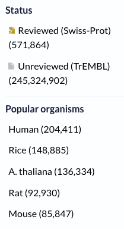
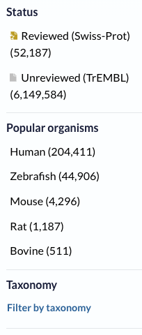
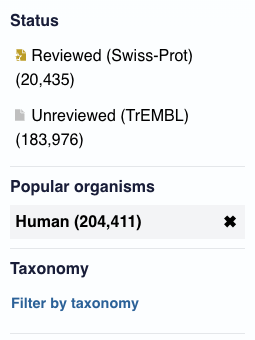
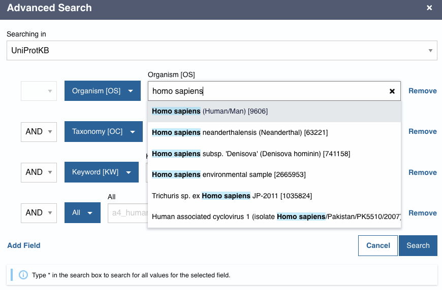
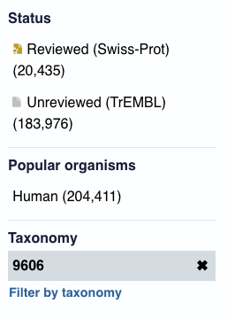
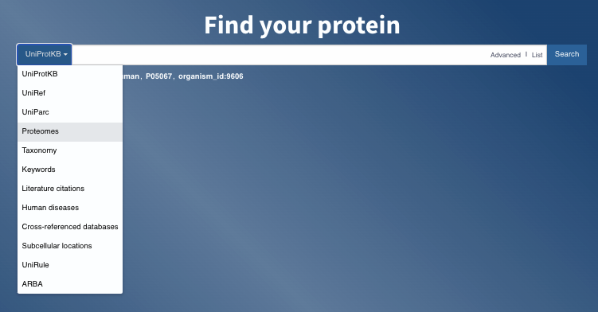
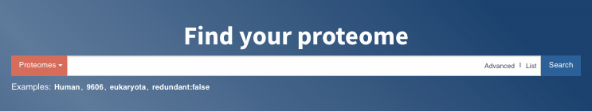
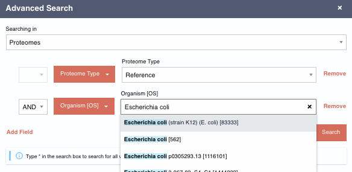
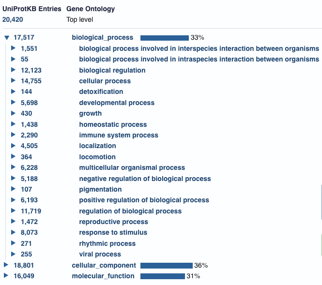

# TP 1 : Séquence - structure - fonction

## Table des matières

- [Auteurs](#auteurs)
- [Introduction](#introduction)
- [Ressources bioinformatiques](#ressources-bioinformatiques) 
- [Uniprot](#uniprot) 
    - [Requête naïve](#requête-naïve)
    - [Requête avancée](#requête-avancée)
    - [Protéome de référence](#protéome-de-référence)
    - [Annotations fonctionnelles](#annotations-fonctionnelles)
- [Analyse de structure](#analyse-de-structure)


## Auteurs

- Jacques van Helden

## Introduction

### But du TP

Durant cette séance de TP, nous analyserons le lien entre séquence, structure tridimensionnelle et fonction des protéines. 

### Exemples traités


### Notions abordées

Ce TP mobilisera les notions suivantes abordées au cours

- Annotation des séquences protéiques
- Eléments structurels (hélice alpha, chapine bêta)

### Compétences acquises au cours de ce TP

- Effectuer une recherche structurée dans une base de connaissances (Swissprot) ou de données (Uniprot)
- Interpréter les annotations fonctionnelles d'une protéine
- Etablir le lien entre annotations fonctionnelles et éléments structurels
- Utiliser des modes de visualisation appropriés pour mettre en évidence différentes propriétés des protéines

## Ressources bioinformatiques

| Ressource | Description | URL |
|:---------------|:-------------------------------------------|:--------------------------------|
| Uniprot | principale base de données mondiale de séquences protéiques et d'informations fonctionnelles | [https://www.uniprot.org/](https://www.uniprot.org/) |
| PDB | Protein Databank, base de données de sructures protéiques | [https://www.rcsb.org/](https://www.rcsb.org/) |
| icn3D | Outil de visualisation et d'analyse des structures protéiques (NCBI) | [https://www.ncbi.nlm.nih.gov/Structure/icn3d/](https://www.ncbi.nlm.nih.gov/Structure/icn3d/) |


## Uniprot

### Requête naïve

Dans un premier temps nous allons faire une requête "naïve" en entrant "Human" dans la boîte de recherche. 

1. Ouvrez une connexion à Uniprot ([uniprot.org](https://uniprot.org))
2. Cliquez **Search** en veillant à laisser la boîte de recherche vide. Ceci sélectionnera l'ensemble des entrées la base de données. 

    - *Quel est le nombre total de protéines?*
    - *Quel est le nombre de protéines révisées par un annotateur?*
    - *Comment s'appelle la base de connaissances des protéines révisées par des annotateurs?*
    - *Quel est le nombre de protéines non révisées?*
    - *Comment s'appelle la base de données des protéines non révisées par des annotateurs?*
    - *Swiss-Prot est (a) une base de données; (b) une base de connaissances*
    - *TrEMBL est (a) une base de données; (b) une base de connaissances*

3. Dans la boîte de recherche, tapez "Human" et cliquez "Search"

    - *combien de résultats au total obtenez-vous?*
    - *combien de résultats obtenez-vous dans Swiss-Prot?*
    - *combien de résultats obtenez-vous dans TrEMBL?*
    - dans la section "Popular organisms" du panneau de gauche, combien de protéines sont associées à l'humain ?
    - quels sont les autres "organismes populaires" ?
    - pourquoi la recherche avec le mot "human" retourne-t-elle des protéines appartenant à d'autres organismes ?

4. Dans la section "Popular organisms", cliquez "Human". 

    - *combien de résultats obtenez-vous dans Swiss-Prot?*
    - *combien de résultats obtenez-vous dans TrEMBL?*


#### Réponses

Résultats de la requête le 19 septembre 2024. 


| Toutes les protéines d'Uniprot  | Requête non structurée "Human" | Après avoir cliqué sur "Homo sapiens" sous "Popular organisms" |
|:-------------------------------:|:-------------------------------:|:-------------------------------:|
|  |  |  |


##### Toutes les protéines d'Uniprot

- *Quel est le nombre total de protéines?* : 245.896.766
- *Quel est le nombre de protéines révisées par un annotateur?* Reviewed (Swiss-Prot) (571.864)
- *Comment s'appelle la base de connaissances des protéines révisées par des annotateurs?* : Swiss-Prot
- *Quel est le nombre de protéines non révisées?* : Unreviewed (TrEMBL) (245,324,902)
- *Comment s'appelle la base de données des protéines non révisées par des annotateurs?* : TrEMBL
- *Swiss-Prot est (a) une base de données; (b) une base de connaissances* : une base de connaissances
- *TrEMBL est (a) une base de données; (b) une base de connaissances* : une base de données


##### Requête non structurée "Human"

- *combien de résultats au total obtenez-vous?* : 6.201.771
- *combien de résultats obtenez-vous dans Swiss-Prot?* : 52.187
- *combien de résultats obtenez-vous dans TrEMBL?* : 6.149.584
- dans la section "Popular organisms" du panneau de gauche, combien de protéines sont associées à l'humain ? : 204.411
- quels sont les autres "organismes populaires" ? : Zebrafish, Mouse, Rat, Bovine
- pourquoi la recherche avec le mot "human" retourne-t-elle des protéines appartenant à d'autres organismes ?
        - parce qu'elle retourne toutes les protéines pour lesquelles les annotations contiennent le mot "Human", quel que soit l'endroit où c'est mentionné. Par exemple, si dans les annotations on indique que la protéine est homologue à une protéin humaine, cette protéine sera  sélectionnée par la recherche. 

##### Après avoir cliqué sur "Homo sapiens" sous "Popular organisms"

(voir capture d'écran ci-dessus)

### Requête avancée

Nous avons vu ci-dessus qu'une requête naïve peut s'avérer trompeuse, car elle retourne toutes les entrées d'Uniprot qui contiennent les termes de la boîte de recherche, sans tenir compte de l'endroit où ces termes apparaissent dans les annotations. Nous recommandons donc fortement d'éviter cela, et de recourir systématiquement aux requêtes avancées. 

1. Revenez à la page d'accueil d'Uniprot en cliquant sur l'icône "Uniprot" en haut à gauche. 
2. Dans la boîte "Find your protein", cliquez le lien "Advanced"
3. Les boîtes bleues vous permettent de restreindre votre recherche à un ou plusieurs champs particulier. Cliquez sur la première boîte bleue, et sélectionnez "Organism [OS]", puis tapez "Homo sapiens" dans la boîte de recherche. Un menu déroulant apparaît avec les différentes possibilités pour Homo sapiens, choisissez la première option ("Homo sapiens (Human/Man) [9606]")


| Requête avancée | Nombre de résultats |
|:------------------------------------:|:------------------------------------|
|  |  |

**Info:** 9606 es l'identifiant taaxonomique de l'espèce *Homo sapiens* dans la base de données taxonomique de référence, qui est gérée par le NCBI. Vous pouvez consulter les informations associées en cherchant "Homo sapiens" sur [www.ncbi.nlm.nih.gov/Taxonomy/](https://www.ncbi.nlm.nih.gov/Taxonomy/)

Voici le lien direct: 
- [www.ncbi.nlm.nih.gov/Taxonomy/Browser/wwwtax.cgi?id=9606](https://www.ncbi.nlm.nih.gov/Taxonomy/Browser/wwwtax.cgi?id=9606)

On notera que ce taxon *inclut* deux variétés fossiles 
- [Homo sapiens neanderthalensis](https://www.ncbi.nlm.nih.gov/Taxonomy/Browser/wwwtax.cgi?id=63221)
- [Homo sapiens subsp. 'Denisova'](https://www.ncbi.nlm.nih.gov/Taxonomy/Browser/wwwtax.cgi?mode=Info&id=741158)

### Protéome de référence

Le protéome d'un organisme consiste en l'ensemble de ses protéines. Dans Uniprot, les séquences protéiques proviennent de la traduction automatique de séquences génomiques. Avec la multiplication des projets de séquençages individuels d'humains, le nombre de séquences différentes a augmenté, avec une certaine redondance. 

Pour faciliter le travail, l'équipe d'Uniprot a défini le concept de "Protéome de référence". 

Après avoir effectué une requête avancée en cherchant Homo sapiens dans le nom d'organisme, le titre de la page de résultat inclut un lien vers le protéome de référence de l'humain. 


> UniProtKB 204,411 results or expand search to "9606" to include lower taxonomic ranks or restrict to reference proteome [UP000005640](https://www.uniprot.org/?query=(organism_id:9606)%20AND%20(proteome:UP000005640))

En cliquant sur le lien  [UP000005640](https://www.uniprot.org/?query=(organism_id:9606)%20AND%20(proteome:UP000005640)), on obtient un protéome totalisant 82.861 protéines dont 20.420 révisée par des annotateurs (Swiss-prot) et 62.441 non-révisées (TrEMBL). 

Notez que la boîte de requête affiche maintenant le texte structuré suivant:

```(organism_id:9606) AND (proteome:UP000005640)```

Vous pouvez construire des requêtes plus complexes avec l'outil "Advanced", qui vous permettra de combiner plusieurs critères de sélection avec différents opérateurs logiques (AND, OR). 

Pour consulter la liste des protéomes de référence, en revenant à la page d'accueil d'Uniprot, et en sélectionnant, à gauche de la boîte de recherche, la section "Proteomes"



Ceci remplace la boîte "Find your protein" par "Find your proteome"



Vous pouvez ensuite effectuer une requête avancée pour sélectionner le protéome de référence (Proteome type) de l'organisme modèle de votre choix (par exemple "Escherichia coli (strain K12) (E.coli) [83333]")




## Annotations fonctionnelles

Nous avons maintenant sélectionné le protéome de référence de l'espèce *Homo sapiens* dans Uniprot. 

Le panneau de gauche permet d'explorer de façon interactive différentes propriétés de ce protéome. 

1. Nous effectuerons cette exploration en nous limitant au sous-ensemble des protéines révisées. Pour cela, cliquez sur "Reviewed (Swiss-Prot)" dans le panneau de gauche.  Ceci restreindra les analyses suivantes aux 20.420 protéines les mieux documentées pour l'humain. 

2. Dans la section "Group by" du panneau de gauche, cliquez "Gene Ontology". Ceci vous affiche le nombre de protéines (parmi les 20.420) pour lesquelles on dispose d'annotation dans chacune des trois catégories de la Gene Ontology: 

    - 17.517 biological_process
    - 18.801 cellular_component
    - 16.049 molecular_function
    
3. Les triangles à gauche de chaque nombre permettent de déployer le niveau suivant de la classification hiérarchique des termes de l'ontologie. Cliquez sur le triangle à gauche de "biological process" pour afficher ses sous-catégories. 



Notez que la somme des nombres des sous-catégories dépasse de loin la taille de la catégorie parente (biological process. Ceci est logique, car une même protéine peut appartenir à plusieurs classes simultanément. Par exemple, une protéine pourrait être impliquée dans la régulation biologique (12.123 protéines) positive (6.193 protéines) d'un procesus de développement (5.698 protéines). Cette protéine sera donc comptée 3 fois à ce niveau de la classification. 

### Exercices

1. Formulez une requête avancée sur l'ensemble des protéines du protéome de référence humain en sélectionnant les enzymes annotées dans Swiss-Prot, qui ont une localisation cytoplasmique et sont impliquées dans la voice canonique de la glycolyse. Combien de protéines obtenez-vous ?

    - *Coup de pouce : utilisez les classes de la Gene Ontology [GO] dans la requête avancée*
        - `canonical glycolysis (GO:0061621) [0061621]`
        - `cytoplasm (GO:0005737) [0005737]`

2. Sélectionnez le protéome de référence de l'un des organismes modèles suivants, et analysez la répartition de ses gènes aux deux premiers niveaux des processus biologiques de la gene ontology. 

    - Escherichia coli (strain K12) (E. coli) [83333]
    - Drosophila melanogaster (Fruit fly/D. melanogaster) [7227]
    - Bacillus subtilis (strain 168) (B. subtilis) [224308]
    - Saccharomyces cerevisiae (strain ATCC 204508 / S288c) (Baker’s yeast/Baker's yeast/Brewer’s yeast/S. cerevisiae) [559292]
    - Mus musculus (Mouse/House mouse/Laboratory mouse) [10090]
    - Rattus norvegicus (Laboratory rat/Buffalo rat/R. norvegicus/Rat/Norway rat/Brown rat) [10116]
    - Arabidopsis thaliana (Mouse-ear cress/Arabidopsis/A. Thaliana/Thale cress) [3702]
    - Oryza sativa subsp. japonica (Japanese rice/O. sativa/Japonica rice/Rice) [39947]
    - Macaca mulatta (Rhesus monkey/M. mulatta/Rhesus macaque) [9544]
    - Mycoplasma genitalium (strain ATCC 33530 / DSM 19775 / NCTC 10195 / G37)


    Pour l'organisme de votre choix, quels sont les valeurs suivantes ?
    
    - Nombre de protéines dans Uniprot
    - Nombre de protéines révisées
    - Nombre de protéines non-révisées
    - Pourcentage de protéines révisées
    
3. Dans Uniprot, ouvrez la fiche de la sous-unité alpha de l'hémoglobine humaine (Hemoglobin subunit alpha)

...

4. Dans le protéome de la levure du boulanger (Saccharomyces cerevisiae (strain ATCC 204508 / S288c) (Baker’s yeast/Baker's yeast/Brewer’s yeast/S. cerevisiae) [559292]), comptez le nombre de protéines appartenant aux classes suivantes. 

    - facteur transcripitionel se liant à l'ADN
    - transporteur
    - protéine cytoplasmique
    - protéine transmembranaire
    - protéine impliquée dans la voie métabolique de la glycolyse

5. Dans le protéome de référence de l'humain, combien y a-t-il de récepteurs olfactifs?

    - 12
    - 120
    - 1200
    - 12000
    - 120000


## Analyse de structure


