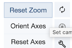

## Analyse de la structure tridimensionnelle des protéines

Auteurs: Jacques van Helden

## Table des matières

- [Introduction](#introduction)
- [Ressources](#ressources)
- [Exploration de PDB](#exploration-de-pdb)
- [Transporteur de glucose](#transporteur-de-glucose)
- [Facultatif: Analyse de la structure avec icn3D](#facultatif-analyse-de-la-structure-avec-icn3d)

[Retour au TP 1](README.md)

----------------------------------------------------------------

## Introduction

Nous allons combiner les informations de Swiss-prot et de la Protein Data Bank (PDB) pour étudier quelques cas illustratifs de relations entre la séquence, la structure et fonction des protéines. 

----------------------------------------------------------------

## Ressources

| Ressource | Description | URL |
|:---------------|:-------------------------------------------|:--------------------------------|
| Uniprot | principale base de données mondiale de séquences protéiques et d'informations fonctionnelles | [https://www.uniprot.org/](https://www.uniprot.org/) |
| PDB | Protein Databank, base de données de sructures protéiques | [https://www.rcsb.org/](https://www.rcsb.org/) |
| icn3D | Outil de visualisation et d'analyse des structures protéiques (NCBI) | [https://www.ncbi.nlm.nih.gov/Structure/icn3d/](https://www.ncbi.nlm.nih.gov/Structure/icn3d/) |

----------------------------------------------------------------

## Exploration de PDB

Nous commençons ce TP par explorer sommairement l'interface usager de Protein Data Bank, la base de données de référence pour les structures tridimensionnelles des protéines. 

1. Ouvrez une connexion à PDB ([www.rcsb.org](https://www.rcsb.org))
2. Notez le nombre de protéines présentes dans PDB

3. En cliquant sur le nombre de structures (expérimentales) affiché en haut de la page d'accueil, vous pourrez observer la répartition de ces structures. Observez le nombre de structures expérimentales caractérisées par organisme, groupe taxonomique, méthode expérimentale, ...

3. Sous la boîte de recherche, cliquez sur "[Browse Annotations](https://www.rcsb.org/search/browse)" pour parcourir la base de données en fonction des propriétés des structures. 

    - Combien de structures (expérimentales) contient PDB ?
    - Quel est l'organisme le plus représenté pour les structures expérimentales ?
    - Quelle est la méthode la plus utilisée pour caractériser les structures expérimentales ?
    - PDB contient d'autres types de macromolécules que les protéines. Citez en un.  
    - Combien PDB contient-elle de modèles de structures rpédites (computed structure models)) ?
    - Quelme est la méthode la plus utilisée pour les structures prédites ?
    - Quel est l'organisme le plus représenté pour les structures prédites ?
    - Quel est le groupe taxonomique le plus représenté pour les structures prédites ?

----------------------------------------------------------------

## Transporteur de glucose

### Annotations du transporteur de glucose dans Uniprot

1. Dans [Uniprot](https://www.uniprot.org/), ouvrez la fiche de la protéine dénommée "Solute carrier family 2, facilitated glucose transporter member 1" (identifiant [GTR1_HUMAN](https://www.uniprot.org/uniprotkb/P11166))

2. Consultez la section "[Subcellular location](https://www.uniprot.org/uniprotkb/P11166/entry#subcellular_location)". 

    - quelle est la localisation sous-cellulaire principale de cette protéine ?
    - combien y a-t-il de domaines transmembranaires annotés dans la section "Features" ?
    - quel est le type de reploiement de ces domaines transmembranaires ?
    - combien y a-t-il d'autres domaines topologiques annotés dans la sous-section "Features" de "Subcellular location" ?
    - combien y a-t-il de domaines cytoplasmiques ?
    - combien y a-t-il de domaines intracellulaires ?

3. Consultez la section "[Diseases and variants](https://www.uniprot.org/uniprotkb/P11166/entry#disease_variants)"

    - quels sont les types de pathologies associés aux mutations de cette protéine ?

### Profils transcriptomiques tissulaires (sur GTEx)

4. Dans un onglet séparé, connectez-vous au portail GTEx ([gtexportal.org/](https://gtexportal.org/)) et consultez le profil transcriptomique du gène qui code pour cette protéine (vous trouverez son nom dans la section "[Names and taxonomy](https://www.uniprot.org/uniprotkb/P11166/entry#names_and_taxonomy)" de la fiche Uniprot)

    - dans quels tissus ce gène est-il principalement exprimé ?
    - voyez-vous un lien avec les pathologies suscitées par des mutations de ce gène ?

### Structure du transporteur de glucose: d'Uniprot à PDB

5. Revenez à la page de cette  protéine (P11166) dans Uniprot et consultez la section "[Structure](https://www.uniprot.org/uniprotkb/P11166/entry#structure)". 

    - Combien y a-t-il de structures disponibles ? 
    - Combien y a-t-il de structures caractérisées expérimentalement ? 
    - Par quelle(s) méthode(s) expérimentale(s) ont-elles été caractérisées ?
    - Quelle est la meilleure résolution (en Angstroms) ?
    

6. CLiquez sur le lien "[RCSC-PDB](https://www.rcsb.org/structure/6THA)" de la structure  avec la meilleure résolution (**6THA**). Ceci ouvre un nouvel onglet vers le serveur RCSC-PDB. 

Dans la seection suivante, nous utiliserons ce serveur pour visualiser la structure du transporteur du glucose et analyser la relation entre séquence et structure. Conservez toutefois l'onglet Uniprot ouvert, nous serons amenés à faire des aller-retours entre PDB et Uniprot. 

### Analyse des relations séquence - structure sur PDB

#### Tutoriel : affichage des annotations de séquence sur la structure

1. Consultez rapidement les annotations  de la structure intitulée ["Crystal structure of human sugar transporter GLUT1 (SLC2A1) in the inward conformation" (identifiant PDB 6THA)](https://www.rcsb.org/structure/6THA) sur le serveur RCSB-PDB. Evaluez les types d'informations disponibles. Notez que la page propose une sérue d'onglets avec différents types d'infirmation (Structure, Annotations, Experiment, Sequence, Genome, Ligands, Versions). Dans ce tutoriel, nous combinerons les informations de séquence et de structure. 

2. Dans la section "Explore 3D" sous l'image de la structure, cliquez "[Sequence annotations](https://www.rcsb.org/3d-sequence/6THA?assemblyId=1)". Ceci ouvre une page avec deux deux panneaux : 

    - à gauche, une carte présentant différentes pistes d'annotation de la séquence protéiques (structures secondaires, "hydropathie", topologie membranaire, segments de membrane...
    - à droite, une représentation de la structure tridimensionnelle de la protéine, affichée en mode "ribbon"
    
Nous allons commencer par personnaliser l'affichage de la protéine, et nous explorerons ensuite les relations entre les caractéristiques de la séquence (panneau de gauche) et de la structure (panneau de droite). 

3. En haut à droite de la fenêtre, une série d'icones vous proposent différents outils pour ma,ipuler et analyser la structure. un premier click sur une icône affiche l'outil, un second click le masque.Cliquez sur l'icône de clé à molette. Ceci affichera deux nouveaux panneaux

    - à droite, une boîte à outils présentant de nombreuses options de personnalisation de l'affichage et d'anlayse de la structure
    - au-dessus de la structure, la séquence de la protéine

Vous pouvez déplacer la limite verticale entre le panneau d'annotation et celui de structure pour qu'ils occupent chacun la moitié de l'écran (sans compter le panneau d'outils). 

4. Dans la section "Components" de la boîte à outils, masquez les molécules d'eau et les ions.  en cliquant sur l'oeil. Testez également l'effet de l'affichage / masquage des autres composantes de la structure, puis veillez à réactiver leur affichage.

5. Nous allons maintennat colorer la protéine pour mettre en évidence ses éléments de structure. A côte de la composante "Polymer", cliquez l'icône `...` pour afficher les options de représentation de la protéine. L'affichage par défaut se fait au niveau de la chaîne polypeptidique, ce qui peut être intéressant pour des complexes protéiques ou protéine-ADN, mais n'est pas très illustratif quand on visualise une protéine composée d'une seule chaîne polypeptidique, ce qui est notre cas. Testez des modes alternatifs de représentation au niveau des propriétés des résidus et interprétez ce que vous voyez. Retenez ensuite la propriété "Sequence ID", qui assigne une couleur différente à chaque élément structurel, selon un gadient du bleu au rouge. 

8. Après avoir personnalisé l'affichage des éléments de structure, nous allons sélectionner différents segments annotés de la protéine (panneau de gauche), et les localiser sur la structure tridimensionnelle (panneau de droite). Cliquez successive=ment sur les segments de la piste d'annotation "Membrane topology" et identifiez les éléments structurels (hélices alpha, feuillets beta) correspondants. Explorez en particulier les éléments structurels (rectangles roses sur la piste "Secondary structure") et les annotations de topologie de membrane (rectangles verts ou violets sur les pistes "Membrane Topology"). 

Quand vous cliquez sur un élément, l'affichage de la structure est recadrée sur cet élément, dans le panneau de droite, et le segment de séquence correspondant est marqué dans la partie supérieure du panneau de droite. Pour voir l'élément dans le contexte global de la protéine, utilisez les options *Reset Zoom*. Faites tourner la structure pour afficher au mieux les segments que vous sélectionnez successivement. Vous pouvez à tout moment revenir à la position initiale avec la fonction *Reset Axes*.

#### Test

- Dans la position initiale de la structure (obtenie après avoir cliqué *Reset Axes*), les segments cytoplasmiques sont-ils situés : (a) en haut; (b) à droite (c); à gauche; (d) en bas. 
- Dans la position initiale de la structure (obtenie après avoir cliqué *Reset Axes*), les segments extracellulaires sont-ils situés : (a) en haut; (b) à droite (c); à gauche; (d) en bas. 
- Dans la position initiale de la structure (obtenie après avoir cliqué *Reset Axes*), les segments transmembranaires sont-ils orientés (a) verticalement; (b) horizontalement; (c) perpendiculairement à l'écran ?
- Quel est le type d'élément structurel associé aux segments transmembranaires ?
- Quels sont les types d'éléments structurels associés au plus grand segment cytoplasmique ?
- Quel est le type d'élément structurel associé plus grand segment extracellulaire ?

----------------------------------------------------------------

### FACULTATIF: Analyse de la structure avec icn3D

Cette section est facultative. Elle permettra à ceux qui le désirent de découvrir un autre outil Web pour l'analyse des structures de protéines. 

1. Dans un onglet séparé, connectez-vous au serveur [icn3D](https://www.ncbi.nlm.nih.gov/Structure/icn3d/), et entrez l'identifiant de la structure PDB (6THA) dans la boîte de requête, et pressez la touche "Entrée". Vérifiez que vous avez bien chargé la bonne structure : *"PDB ID 6THA: Crystal structure of human sugar transporter GLUT1 (SLC2A1) in the inward conformation"*.

2. Choisissez une coloration en arc-en-ciel pour repérer la position des différents éléments de structure par rapport aux extrémités de la chaîne polypeptidique (*Color -> Rainbow -> For Chains*). 

3. Testez les différents modes d'affichage de la protéine en explorant les options du menu *Styles -> Proteins* et tentez d'identifier l'intérêt des différents modes de représentation. En particulier, assurez-vous de comprendre les options d'affichage suivantes : 

    - C Alpha trace
    - Balls and stick
    - Sphere
    - Backbone
    - Ribbon

(la réponse à cette question peut faire l'objet d'un debriefing en séance)

3. Revenz à la représentation Ribbon, que nous utiliserons principalement pour la suite. 

4. Faites tourner la structure et localisez les molécules qui ne font pas partie de la protéine. Sélectionnez ces molécules (*Select -> Defined sets*, puis cliquez *chemicals* dans la boîte qui apparaît à droite de la fenêtre). Affichez-les en style "Balls and stick" (*Style -> Chemicals -> Balls and sticks*), et colorez-les en fonction des atomes (*Color -> Atom*). Désélectionnez ensuite ces molécules (*Select -> Clear Selection*). 

5. Sélectionnez la protéine (*Select -> Defined sets* puis *protein*) et colorez-la en fonction de la charge des résidus (*Color -> Charge*). Défaites la sélection pour mieux voir le résultat. 

    - estimez le nombre de résidus chargés positivement
    - estimez le nombre de résidus chargés négativement
    - estimez la proportion de ces résidus par rapport à la taille de la protéine

6. Analysez la localisation de ces résidus chargés, et interprétez le résultat dans le contexte des annotations d'Uniprot. 

    - quelle est la localisation majoritaire pour les résidus chargés ?
    - il y a-t-il des résidus chargés localisés dans les parties transmembranaires ?
    - si oui, sont-ils localisés du côté extérieur (membrane) ou intérieur (canal) du transporteur ?

 
----------------------------------------------------------------

[Retour au TP 1](README.md)

----------------------------------------------------------------
