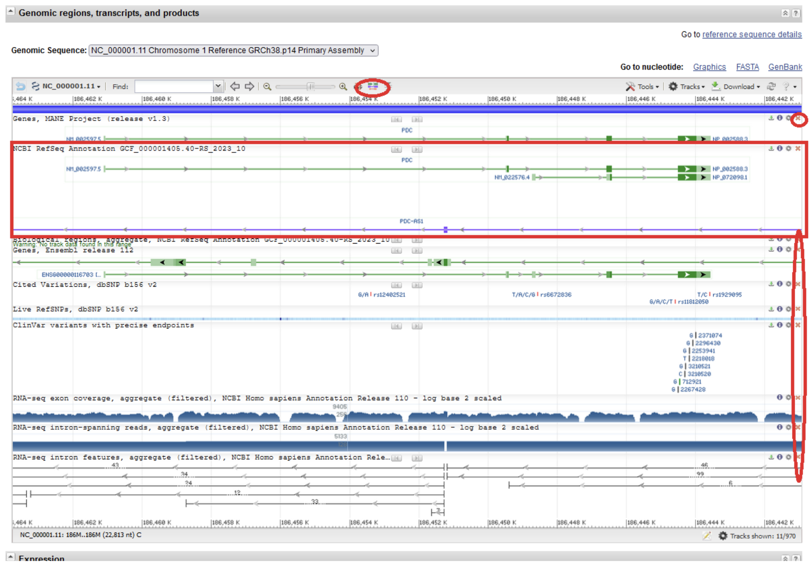

# TP 2 : Du gène à la protéine

## Table des matières

- [Auteurs](#auteurs)
- [Introduction](#introduction)
- [Ressources informatiques](#ressources-informatiques) 
- [Tutoriels et exercices](#tutoriels-et-exercices) 
- [Que retenir de ce TP ?](#que-retenir-de-ce-tp)

## Auteurs

- Emese Meglécz
- Bénédicte Wirth
- Aitor Gonzalez
  
## Introduction

### But du TP

Dans ce TP vous apprendrez à effectuer une recherche dans une base de données, et à réaliser les alignements par paires de séquences.

### Concepts

Dans un gène eucaryote, les exons et les introns sont alternés. Après transcription du gène en ARN primaire, la maturation de ce transcrit inclut généralement une étape d’épissage, qui consiste à éliminer les introns et à rabouter les exons. Au terme de ce processus, seuls les exons seront présents dans l’ARN mature. Quand on aligne l’ADN d’un gène avec son ARN mature, on devrait donc trouver des régions parfaitement alignées et identiques entre elles à 100% (les exons) séparées par de longs gaps de l’alignement, qui correspondent aux introns (présents dans le gène, mais absents de l’ARN mature). Il faut noter que ce processus d’épissage peut se produire dans les gènes codants ou non codants (ARN de transfert ou ribosomique). 

Pour les gènes codants, l’ARN "messager"" (ARNm) comporte une région codante, des régions non traduites en amont (5’ UTR), en aval (3’ UTR). La région codante sert de modèle pour synthétiser une protéine en polymérisant des acides aminés (traduction). Similairement, en alignant la traduction de l’ARN avec la protéine codée par le gène, la protéine devrait s’aligner avec les régions codantes des exons, mais pas avec les régions UTR.

### Exemples traités

Nous nous baserons sur le cas d’étude suivant. 

**Comparaison des séquences de gène de phosducine (PDC) sa transcription (l’ARNm) et la protéine codée par le gène**. La phosphoducine est une phosphoprotéine située dans les  bâtonnets de la rétine. Elle module la cascade de phototransduction en interagissant avec la protéine G rétinienne. Le gène est un gène candidat pour la rétinite pigmentaire et le syndrome d'Usher de type II. Des variantes de transcription à épissage alternatif codant pour différentes isoformes ont été identifiées.

### Notions abordées

Nous mettrons en pratique plusieurs notions abordées lors des CM: 
- Gène, exon, intron, UTR
- Alignment par paire
- Complémentarité des nucléotides, et séquences réverse complémentaires
- Traduction
- Cadre de lecture (traduction)

N’oubliez pas que vous pouvez à tout moment consulter le **glossaire du cours** pour obtenir une définition sommaire des principaux termes utilisés. 

### Compétences acquises au cours de ce TP

A l’issue de ce TP, vous devriez avoir acquis les compétences suivantes. 

- Recherche avancée dans une base de donnée de séquences
- Téléchargement des séquences
- Alignement par paire (alignement exact et BLAST)
- Interprétation des alignements et leurs divers représentations graphique

## Ressources informatiques

| Ressource | Lien | Description |
|:---------|:--------------------------|:-------------------------------------------|
| NCBI gene | [https://www.ncbi.nlm.nih.gov/gene/](https://www.ncbi.nlm.nih.gov/gene/) | Base de données des gène hébergée par NCBI |
| Sequence Manipulation Suite (**SMS**) | [http://www.bioinformatics.org/sms2/](http://www.bioinformatics.org/sms2/) |  Large gammes d’outils pour la manipulation des séquences biologiques (traduction, reverse complement, ORFfinder...) |
| needle | [https://www.ebi.ac.uk/jdispatcher/psa/emboss_needle](https://www.ebi.ac.uk/jdispatcher/psa/emboss_needle)  |  Algorithme d’alignement par paire (méthode de Needleman-Wunsch, exacte, produisant des alignements globaux) |
| NCBI BLAST|  [https://blast.ncbi.nlm.nih.gov/Blast.cgi](https://blast.ncbi.nlm.nih.gov/Blast.cgi)  |  Recherche par similarité: comparaison d’une séquence à une base de données  |

## Exercice 1 - Téléchargement des séquences à partir de NCBI Gene

1. Connectez-vous à la base de données [NCBI Gene](https://www.ncbi.nlm.nih.gov/gene/).
2. Effectuez une recherche avancée pour trouver des séquences de **Phosducin** chez l'**humain**. Pour cela :

    a. Cliquez sur ‘Advanced’ en dessous de la boîte de recherche sur la page d’accueil de la base de données. 
    
    
    
    b. Choisissez le champ ‘Organism‘ dans le premier menu déroulant, et entrez ‘Homo sapiens’ dans la boîte de recherche à côté, pour spécifier que vous cherchez uniquement des séquences humaines.
    
    c. Dans le second menu déroulant, choisissez ‘Gene name’ et entrez ‘PDC’ dans la boîte de recherche à côté, pour spécifier que vous cherchez le gène PDC (abréviation de Phosducin).
    
    d. Les deux expressions de recherche Homo sapiens[Organism] et PDC[Gene Name] sont automatiquement connectées par le connecteur logique AND, pour spécifier que les deux conditions doivent être remplies à la fois. Ceci correspond à notre but, mais dans d’autres cas, il est possible de changer le connecteur logique en OR ou NOT selon les besoins (cf le petit menu déroulant correspondant).
    
    e. La phrase de recherche (Homo sapiens[Organism]) AND PDC[Gene Name] apparait dans la boite de recherche principale (en haut).
    
    
    
    f. Cliquez sur **Search**.

    g. Parmi les résultats obtenus, cliquez sur la ligne avec le nom de gène PDC (ID : 5132). L’autre résultat apparaît car PDC est un nom alternatif pour le gène PNDK. Ceci ne nous intéresse pas pour le moment.

3. Sur la page de résultats du gène PDC (ID : 5132), intéressons-nous à la section ‘Genomic regions, transcripts, and products’ et particulièrement au champ ‘NCBI RefSeq Annotation’.

    a. Éliminez les champs qui ne nous intéressent pas pour le moment, en utilisant les croix en haut à droite de chaque champ. Puis, cliquez sur le bouton ‘Switch ON mode "Show all" for Gene Tracks’.

    
    
    b. Sur l’affichage dans le champ ‘NCBI RefSeq Annotation’, vous pouvez utiliser les boutons Zoom In et Zoom Out pour que la totalité du gène apparaisse sur votre écran, et les flèches pour centrer l’affichage sur le gène.

    

    c. La ligne verte représente le gène, les lignes violettes deux transcrits alternatifs de l’ARNm et les lignes rouges les protéines codées par ces deux variants d’ARNm. Les parties épaisses des lignes violettes et rouges sont respectivement les portions de séquence présentes dans l’ARNm mature  et traduites en protéine. Faites une capture d’écran ou laissez cette page ouverte, car vous aurez besoin de ce graphique plus tard.

        **Questions**
        
        - Quelle est la taille du gène PDC ?
        - Quelle est la taille du variant 1 d’ARNm ? 
        - Comment expliquez-vous cette différence de taille ?
        - Combien d’exons trouvez-vous dans l’ARNm variant 1 et variant 2 ?
        - Comparez les longueurs des exons et introns. Lesquels sont les plus longs ?
        - Tous les exons sont-ils traduits en acides aminés sur toutes leurs longueurs ?

    d. Quand vous posez la souris sur les lignes (sans cliquer) une boîte apparaît avec des informations essentielles, et les liens vers les séquences. Utilisez ces liens pour télécharger les séquences du gène, du variant 1 de l'ARNm et de l'isoforme a de la protéine en format FASTA et enregistrez-les.
    
        **Questions**
        - Sur quel chromosome se trouve le gène ?
        - Quelles sont les coordonnées du gène (position de début et fin) sur le chromosome ?
        - Le gène se trouve-t-il sur le brin + ou le brin - ?

4. La séquence téléchargée du gène est un extrait du brin direct (ou brin plus) du chromosome. Il faut donc utiliser la séquence complémentaire de cette séquence pour orienter correctement la séquence du gène.
    a. Connectez-vous à SMS ([Sequence Manipulation Suite](http://www.bioinformatics.org/sms2/)) et trouvez l’outil **Reverse Complement** dans le menu à gauche.
    b. Générez le "reverse complément"" de la séquence du gène PDC. Pour la suite du TP, vous devrez toujours utiliser cette séquence complémentaire comme séquence du gène PDC.

### Tutoriel 1 : 

### Exercice 1 : 

### Tutoriel 2 : 

### Exercice 2 : 

## Que retenir de ce TP
