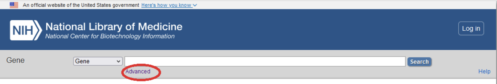
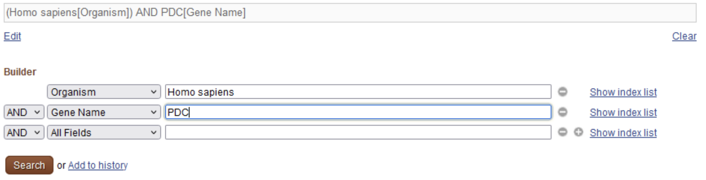
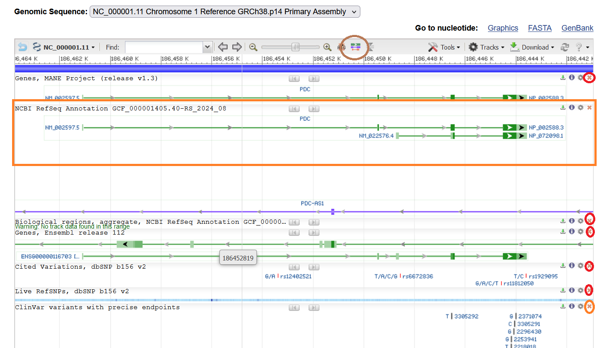
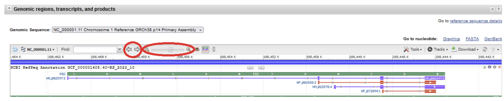
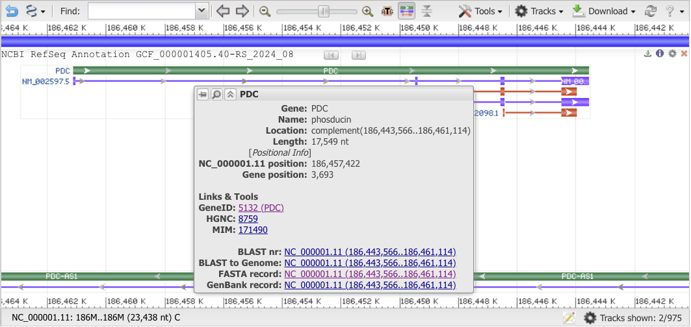
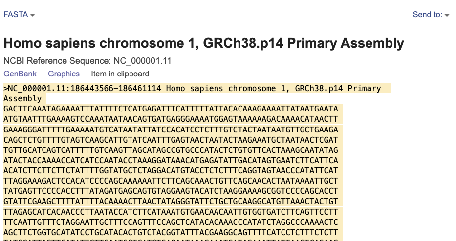
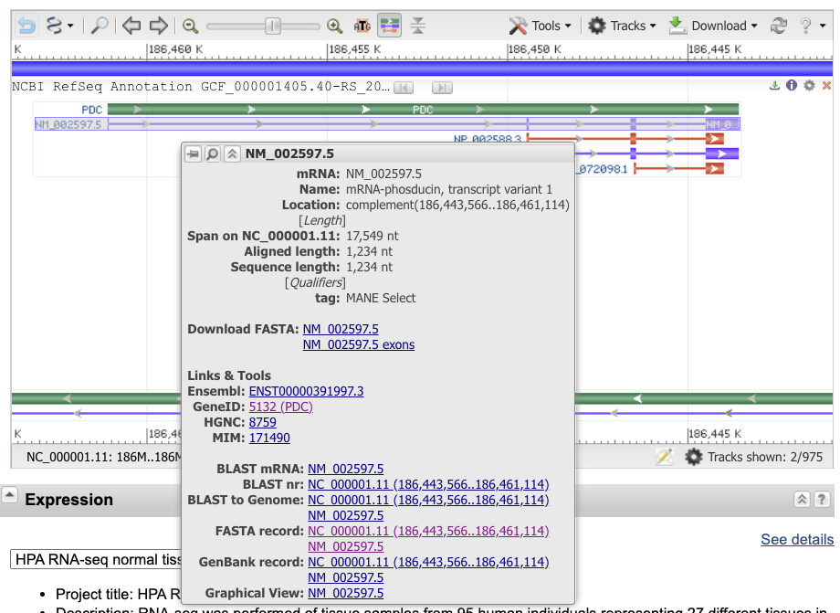

# TP 2 : Du gène à la protéine

## Table des matières

- [Introduction](#introduction)
- [Ressources bioinformatiques](#ressources-bioinformatiques) 
- [Exercice 1 - Téléchargement des séquences à partir de NCBI Gene](#exercice-1---téléchargement-des-séquences-à-partir-de-ncbi-gene)
- [Exercice 2 - Comparaison d'un gène et de son ARNm - alignement global avec needle](#exercice-2---comparaison-dun-gène-et-de-son-arnm---alignement-global-avec-needle)
- [Exercice 3 - Comparaison de l'ARNm et de la protéine - alignement local avec BLAST](#exercice-3---comparaison-de-larnm-et-de-la-protéine---alignement-local-avec-blast)
- [Exercice 4 - Comparaison de l'ARNm et protéine - alignement global avec needle](#exercice-4---comparaison-de-larnm-et-protéine---alignement-global-avec-needle)
- [Exercice 5 - Comparaison d'un gène et de son ARNm - alignement local avec BLAST](#exercice-5---comparaison-dun-gène-et-de-son-arnm---alignement-local-avec-blast)

- [Que retenir de ce TP ?](#que-retenir-de-ce-tp)

## Auteurs

- Emese Meglécz
- Bénédicte Wirth
- Aitor Gonzalez

----------------------------------------------------------------

## Introduction

### But du TP

Dans ce TP vous apprendrez à effectuer une recherche dans une base de données, et à réaliser les alignements par paires de séquences.

### Concepts

Chez les eucaryotes, après transcription, la maturation de l'ARN primaire inclut généralement une étape d'épissage, qui consiste à éliminer certains fragments (appelés **introns**) et à rabouter les autres (appelés **exons**). Dans les annotations génomiques, un gène eucaryote se présente donc sous la forme d'une alternance d'exons et d'introns.  Au terme de l'épissage, seuls les exons seront présents dans l'ARN mature. 

Quand on aligne l'ADN d'un gène avec son ARN mature, on devrait donc trouver des régions parfaitement alignées et identiques entre elles à 100% (les exons) séparées par de longs gaps de l'alignement, qui correspondent aux introns (présents dans le gène, mais absents de l'ARN mature). 

Il faut noter que ce processus d'épissage peut se produire dans les gènes codants ou non codants (ARN de transfert ou ribosomique). 

Pour les gènes codants, l'**ARN messager** (ARNm) comporte une région codante, des **régions non traduites** en amont (5' UTR), en aval (3' UTR). Seule la région codante sert de modèle pour synthétiser une protéine en polymérisant des acides aminés (traduction). Par conséquent, si on aligne la séquence protéique avec une traduction de l'ARN, la protéine devrait s'aligner avec les régions codantes des exons, mais pas avec les régions UTR en 5' et 3'.

### Exemples traités

Nous nous baserons sur le cas d'étude suivant. 

**Comparaison entre les séquences du gène de la phosducine (PDC), son transcrit (l'ARNm) et la protéine codée par le gène**. La phosducine est une phosphoprotéine située dans les  bâtonnets de la rétine. Elle module la cascade de phototransduction en interagissant avec la protéine G rétinienne. Le gène est impliqué dans la rétinite pigmentaire et le syndrome d'Usher de type II. Des variants de transcription ont été identifiés, qui codent pour différentes isoformes de la protéine via un épissage alternatif.

### Notions abordées

Dans ce TP, nous mettrons en pratique plusieurs notions abordées lors des CM :

- gène, exon, intron, UTR,
- alignement par paire,
- complémentarité des nucléotides, et séquences réverse complémentaires,
- traduction,
- cadre de lecture (traduction)

N'oubliez pas que vous pouvez à tout moment consulter le **[glossaire du cours](../../glossaire_bioinfo/glossaire_bioinfo.html)** pour obtenir une définition sommaire des principaux termes utilisés. 

### Compétences acquises au cours de ce TP

A l'issue de ce TP, vous devriez avoir acquis les compétences suivantes. 

- Recherche avancée dans une base de donnée de séquences
- Téléchargement des séquences
- Alignement par paire (alignement exact et BLAST)
- Interprétation des alignements et leurs diverses représentations graphiques

----------------------------------------------------------------

## Ressources bioinformatiques

| Ressource | Lien | Description |
|:---------|:-----------------|:-------------------------------------------------------|
| NCBI gene | [https://www.ncbi.nlm.nih.gov/gene/](https://www.ncbi.nlm.nih.gov/gene/) | Base de données de gènes hébergée par NCBI |
| Sequence Manipulation Suite (**SMS**) | [http://www.bioinformatics.org/sms2/](http://www.bioinformatics.org/sms2/) |  Large gammes d'outils pour la manipulation des séquences biologiques (traduction, réverse complément, ORFfinder...) |
| needle | [https://www.ebi.ac.uk/jdispatcher/psa/emboss_needle](https://www.ebi.ac.uk/jdispatcher/psa/emboss_needle)  |  Algorithme d'alignement par paire (méthode de Needleman-Wunsch, exacte, produisant des alignements globaux) |
| NCBI BLAST|  [https://blast.ncbi.nlm.nih.gov/Blast.cgi](https://blast.ncbi.nlm.nih.gov/Blast.cgi)  |  Recherche par similarité: comparaison d'une séquence à une base de données  |

----------------------------------------------------------------

## Exercice 1 - Téléchargement des séquences à partir de NCBI Gene

1. Connectez-vous à la base de données [NCBI Gene](https://www.ncbi.nlm.nih.gov/gene/).
2. Effectuez une recherche avancée pour trouver des séquences de **Phosducin** (nom de gène **PDC**) chez l'**humain**. Pour cela :

    a. Cliquez sur ‘**Advanced**' en dessous de la boîte de recherche sur la page d'accueil de la base de données. 
    
    
    
    b. Choisissez le champ '**Organism**' dans le premier menu déroulant, et entrez '**Homo sapiens**' dans la boîte de recherche à côté, pour spécifier que vous cherchez uniquement des séquences humaines.
    
    c. Dans le second menu déroulant, choisissez '**Gene name**' et entrez '**PDC**' dans la boîte de recherche à côté, pour spécifier que vous cherchez le gène PDC (abréviation de Phosducin).
    
    d. Les deux expressions de recherche `Homo sapiens[Organism]` et `PDC[Gene Name]` sont automatiquement connectées par le connecteur logique `AND`, pour spécifier que les deux conditions doivent être remplies à la fois. Ceci correspond à notre but, mais dans d'autres cas, il est possible de changer le connecteur logique en `OR` ou `NOT` selon les besoins (cf le petit menu déroulant correspondant).
    
    e. La phrase de recherche `(Homo sapiens[Organism]) AND PDC[Gene Name]` apparait dans la boite de recherche principale (en haut).
    
    {width=700}
    
    f. Cliquez sur **Search**.

    g. Parmi les résultats obtenus, cliquez sur la ligne avec le nom de gène **PDC (ID : 5132)**. L'autre résultat apparaît car PDC est un nom alternatif pour le gène PNDK. Ceci ne nous intéresse pas pour le moment.

3. Sur la page de résultats du gène **PDC (ID : 5132)**, descendez jusqu'à la section '**Genomic regions, transcripts, and products**' ou cliquez sur le lien correspondant dans le panneau de droite. Ceci vous affiche une carte avec plusieurs pistes d'annotations génomiques.  Nous allons nous intéresser plus particulièrement à la piste '**NCBI RefSeq Annotation**'.

    a. Supprimez les champs qui ne nous intéressent pas pour le moment, en cliquant sur les croix en haut à droite de chaque piste d'annotation (cercles rouges sur l'illustration ci-dessous). La partie supérieure du navigateur affiche une série d'icônes permettant de configurer la représentation. En déplaçant votre souris sur les  icônes, une description s'affiche pour chaque outil. Identifiez l'icône  ‘**Switch ON mode "Show all" for Gene Tracks**' (entouré en marron sur l'illustration ci-dessous). Activez cette option, qui affichera les transcrits alternatifs et régions codantes. 

    {width=500}
    
    b. Dans cette même barre d'outils, vous pouvez utiliser les boutons **Zoom In** et **Zoom Out** pour que la totalité du gène occupe une proportion plus ou moins grande sur votre écran, et les flèches pour modifier le centrage de l'image. Vous pouvez également modifier le centrage en cliquant sur l'image pour la faire glisser à gauche ou à droite. Ceci vous permet notamment d'observer le voisinage du gène (régions intergéniques, gènes voisins).

    

    **Lecture du graphique ci-dessus:** 
    
    - la <b>bande verte</b> représente le gène
    
    - les deux <b>bandes violettes</b> les transcrits alternatifs, et les ARNm correspondants. Les lignes fines correspondent aux introns, les rectangles plus épais aux exons. L'ARN messager est donc la concaténation des parties épaisses. 
    
    - les <b>lignes rouges</b> associées à chaque transcrit correspondent à l'étendue qui va du codon start au codon stop, autrement dit le transcrit moins les UTR 5' et 3'. Les parties épaisses correspondent donc aux régions codantes (*coding sequences, CDS*), séparées par des introns. 
    
    - les flèches indiquent le sens de la transcription. **Attention :** sur le navigateur de gènes du NCBI, les gènes sont toujours affichés de gauche à droite, indépendamment de leur brin direct ou complémentaire. Pour les gènes situés sur le brin complémentaire, les coordonnées affichées en haut du graphique vont en décroissant.  

    <b>Veillez à laisser cet onglet ouvert pendant le reste du TP, car vous aurez besoin de revenir sur ce graphique à plusieurs reprises.</b>
    
    c. Déplacez votre souris pour positionner le curseur au-dessus du gène *sans cliquer*. Une boîte apparaît, qui affiche des informations détaillées, et des liens vers les séquences. Prenez connaissance des informations affichées, puis déplacez votre curseur au-dessus des autres annotations – les deux transcrits violets, et les régions codantes associées. 

    {width=500}
    
    **Questions** (hors questionnaire)
        
    - Quelle est l'orientation du gène PDC ?
    - Quelle est la taille du gène PDC ?
    - Quelle est l'étendue du transcrit variant 1 ?
    - Quelle est la longueur de l'ARNm correspondant ? 
    - Comment expliquez-vous cette différence de taille ?
    - Combien d'exons trouvez-vous dans l'ARNm variant 1 et variant 2 ?
    - Comparez les longueurs des exons et introns. Lesquels sont les plus longs ?
    - Tous les exons sont-ils traduits en acides aminés sur toute leur longueur ?

    

    **Obtention des séquences**

    d. Les boîtes d'information des gènes, transcrits ou régions codantes permettent également d'obtenir leur séquence. Déplacez à nouveau votre souris pour positionner le curseur au-dessus du gène *sans cliquer*. Dans la boîte d'informations détaillées, cliquez sur le lien qui apparaît à côté de FASTA record (astuce: les identifiants des séquences génomiques du NCBI commencent par "NC_""). Ceci ouvre un nouvel onglet avec la séquence génomique du gène PDC. 

    e. Sélectionnez l'ensemble de la séquence, en veillant à inclure la ligne d'en-tête (caractéristique du format de séquence FASTA), et à descendre jusqu'au bas de la page. Copiez la séquence ainsi sélectionnée. 

    La ligne d'en-tête (figure ci-dessous) commence par un '>', suivi de l'identifiant de la séquence chromosomique et de l'étendue de la région d'intérêt (`NC_000001.11:186443566-186461114`), et de quelques informations optionnelles. 

    {width=500}

    **Questions**  (hors questionnaire)
    - Sur quel chromosome se trouve le gène ?
    - Quelles sont les coordonnées du gène (position de début et fin) sur le chromosome ?
    - Le gène est-il situé sur le brin + ou - ?
    - La séquence affichée correspond-elle au brin + ou - ? (basez vous sur les coordonnées)

4. La séquence téléchargée du gène est un extrait du brin direct (ou brin plus) du chromosome. Il faut donc obtenir la séquence complémentaire de cette séquence pour orienter correctement la séquence du gène.

    a. Connectez-vous au site **SMS** ([Sequence Manipulation Suite](http://www.bioinformatics.org/sms2/)) et trouvez l'outil **Reverse Complement** dans le menu à gauche.
   
    b. Générez le "reverse complément" de la séquence du gène PDC. Pour la suite du TP, vous devrez toujours utiliser cette séquence complémentaire comme séquence du gène PDC.
    
    c. Veillez à maintenir cet onglet ouvert, nous utiliserons cette séquence du gène dans l'exercice suivant. 

**Extraction de la séquence d'ARN messager**

5. Revenez à l'onglet du gène PDC dans NCBI Gene. Positionnez le curseur sur le transcrit 1 afin de faire apparaître la boîte d'informations détaillées. Cliquez sur l'identifiant **NM_...** à côté de "Download FASTA". Ceci ouvre un nouvel onglet avec la séquence de l'ARN (**Astuce: ** dans la base de données NCBI Gene, les identifiants d'ARN **m**essagers sont préfixés **NM_**). Conservez cet onglet ouvert, nous reviendrons dessus pour les exercices suivants. 

{width=500}

**Extraction de la séquence codante**

6. Revenez une fois de plus à l'onglet du gène PDC dans NCBI Gene. Cliquez sur l'identifiant **NP_...** à côté de "Download FASTA". Ceci ouvre un nouvel onglet avec la séquence d'acides aminés de la protéine codée par PDC (**Astuce: ** dans la base de données NCBI Gene, les identifiants de séquences **p**rotéiques sont préfixés **NP_**). Conservez cet onglet ouvert, nous reviendrons dessus pour les exercices suivants. 

{width=500}

### Questionnaire TP2 – Exercice 1

Sur Ametice, ouvrez le questionnaire du TP2 et répondez aux questions de l'Exercice 1.

----------------------------------------------------------------

## Exercice 2 - Comparaison d'un gène et de son ARNm - alignement global avec needle

Dans cet exercice, vous allez aligner la séquence du gène PDC avec celle du variant 1 d'ARNm afin d'identifier les exons et introns dans le gène. Le schéma ci-dessous est un rappel de l'exercice 1. Il vous aidera à interpréter des alignements.

1. Connectez-vous à l'outil [needle sur EBI](https://www.ebi.ac.uk/jdispatcher/psa/emboss_needle). Needle est un logiciel qui fait des **alignements globaux entre deux séquences**.
2. Choisissez DNA dans le champ **Sequence type**.
3. Entrez la séquence du gène (correctement orientée) dans le premier encadré 
4. Revenez à l'onglet avec l'ARNm de PDC, copiez la séquence de l'ARNm (en incluant l'en-tête fasta), et collez-la dans le deuxième encadré. 

    **Astuce !** Quand vous copiez une séquence en format FASTA, veillez à inclure les en-têtes d'identification (lignes commençant par le signe `>`). Ces identifiants apparaîtront alors dans l'alignement, ce qui vous aidera à savoir quelle séquence correspond au gène ou à l'ARN.

5. Ajoutez un titre pour vous souvenir de la comparaison, par exemple "PDC gene versus mRNA". 

6. Cliquez **Submit**.

7. Regardez l'alignement, et comparez le avec le schéma vu précédemment sur **NCBI Gene**. Cet alignement est-il cohérent avec vos attentes ? Pourquoi ?

8. Refaisons l'alignement en modifiant les paramètres de logiciel needle.

   a. Suivez la même procédure que précédemment, mais dans le champ **'Parameters'** cliquer sur **'More options'**.

   b. Réglez
    - GAP OPEN : 100
    - GAP EXTEND : 0
    - Laissez les autres paramètres à leurs valeurs par défaut.

### Questionnaire TP2 – Exercice 2
Allez sur le questionnaire de TP2 sur Ametice et répondez aux questions de l'Exercice 2.

----------------------------------------------------------------

## Exercice 3 - Comparaison de l'ARNm et de la protéine - alignement local avec BLAST

On ne peut pas aligner directement une séquence protéique avec une séquence nucléique. Une possibilité serait de traduire la séquence d'ARNm en acides aminés à l'aide d'un programme de traduction comme celui de [Sequence Manipulation Suite](http://www.bioinformatics.org/sms2/). Dans ce cas, il est difficile de savoir dans quel cadre de lecture il faut faire cette traduction.

Une autre possibilité est d'utiliser le logiciel BLAST. Le but original de BLAST est de comparer une séquence (séquence requête) avec l'ensemble des séquences contenues dans une base de données, afin de de trouver des séquences similaires à la séquence requête. Il est possible de détourner cette fonction originale en alignant une séquence donnée avec une ou plusieurs autres séquences, fournies par l'utilisateur.

L'avantage est que BLAST peut comparer des séquences de différentes natures (séquences protéiques ou nucléiques) en faisant la traduction automatique des séquences nucléiques dans les 6 cadres de lecture possibles (3 sur le brin+ et 3 sur le brin-). Il alignera ensuite les traductions des séquences nucléiques avec les séquences protéiques. 
BLAST fait des alignements locaux, ce qui veut dire qu'il alignera que des portions des séquences qui sont similaires.

1. Connectez-vous à l'[NCBI BLAST](https://blast.ncbi.nlm.nih.gov/) et choisissez **blastx**. C'est la version de BLAST qui compare une séquence requête nucléique avec des séquences protéiques.
2. Cochez la case **'Align two or more sequences'**. Un cadre supplémentaire apparaît.
3. Entrez la séquence de l'ARNm dans le premier cadre (**Enter Query Sequence**) et la séquence la protéine dans le deuxième (**Enter Subject Sequence**).
4. Cochez la case **'Show results in a new window'** pour que les résultats apparaissent dans une nouvelle fenêtre sans fermer le formulaire de BLAST.
5. Cliquez sur le bouton 'BLAST' pour lancer l'alignement.
6. Sur la page de résultats, dans l'onglet **'Graphic Summary'**, on peut voir que la protéine (représentée par une ligne rouge) s'aligne à peu près entre les positions 50 et 800 de l'ARNm (représenté par la ligne turquoise épaisse, notée **Query**).
7. Dans l'onglet **'Alignments'**, on peut trouver les positions précises de début et de fin de l'alignement (81-818 pour ARNm 1-246 pour la protéine). Il y a 100 % d'identité sur la longueur totale de la protéine. Dans l'entête de l'alignement, **Frame +3** indique que l'alignement a été fait entre la protéine et la traduction de l'ARNm sur le brin+ dans la cadre de lecture 3.

### Questionnaire TP2 – Exercice 3

Allez sur le questionnaire de TP2 sur Ametice et répondez aux questions de l'Exercice 3.

----------------------------------------------------------------

## Exercice 4 - Comparaison de l'ARNm et protéine - alignement global avec needle

Maintenant qu'on sait qu'il faut traduire l'ARNm dans le cadre 3, on peut utiliser needle, pour faire un alignement global.

1. Connectez-vous à [SMS (Sequence Manipulation Suite)](http://www.bioinformatics.org/sms2/) et trouvez l'outil **'Translate'** dans le menu à gauche.
2. Traduisez l'ARNm sur le brin direct dans la cadre de lecture 3. Nous avons une séquence humaine, d'un gène nucléaire. Quel Code génétique allez-vous utiliser ?
3. Connectez-vous à l'outil [needle](https://www.ebi.ac.uk/jdispatcher/psa/emboss_needle/) sur EBI.
4. Choisissez Protein dans le champ **'Sequence type'**.
5. Entrez la **séquence traduite de l'ARNm** et la séquence de la **protéine** dans les deux cases suivantes.
6. Cliquer sur **Submit**.
7. Regardez l'alignement. Est-ce cohérent de vos attentes ?

### Questionnaire TP2 – Exercice 4

Allez sur le questionnaire de TP2 sur Ametice et répondez aux questions de l'Exercice 4.

----------------------------------------------------------------

## Exercice 5 - Comparaison d'un gène et de son ARNm - alignement local avec BLAST

Utilisons maintenant le logiciel BLAST, pour comparer le gène et sa transcription mature. Vous avez vu à l'exercice 2 que l'alignement global entre ces deux séquences est pratique pour pouvoir détecter des introns et les exons, mais l'alignement est très long et difficile à voir dans son ensemble.

Utilisons maintenant BLAST qui produit les alignements locaux et donc affiche que des régions significativement similaires. On peut aussi profiter des différents affichages graphiques des résultats.

1. Connectez-vous à l'[NCBI BLAST](https://blast.ncbi.nlm.nih.gov/) et choisissez **blastn**. C'est la version de BLAST qui compare une séquence requête nucléique avec des séquences nucléiques.
2. Cochez la case **'Align two or more sequences'**. Un cadre supplémentaire apparaît.
3. Entrez la séquence de gène correctement orienté dans le premier cadre (**Enter Query Sequence**) et la séquence l'ARNm mature dans le deuxième (**Enter Subject Sequence**).
4. Cochez la case **'Show results in a new window'** pour que les résultats apparaissent dans une nouvelle fenêtre sans fermer le formulaire de BLAST.
5. Cliquez sur le bouton 'BLAST' pour lancer l'alignement.
6. Sur la page de résultats

   a. Dans l'onglet **'Graphique Summary'**, la séquence du gène est représentée par la ligne turquoise épaisse, (notée **Query**) et les lignes courtes roses et rouges représentent l'ARNm.

   b. Dans l'onglet **'Alignements'** vous trouvez 4 alignements locaux.

   c. L'onglet **'Dot Plot'** est une représentation visuelle des alignements. En abscisse vous trouvez les positions dans le gène, en ordonnée les positions de ARNm. Les lignes obliques montrent des régions où le gène et l'ARNm s'alignent.

### Questionnaire TP2 – Exercice 5

Sur Ametice, ouvrez le questionnaire de TP2 et répondez aux questions de l'Exercice 5.

## Que retenir de ce TP
Au cours de ce TP, nous avons vu qu'un gène d'eucaryote consiste en une succession d'exons et d'introns. Les gènes sont transcrits en ARN primaire, qui font l'objet de différentes étapes de maturation. Les ARN matures sont exportés dans le cytoplasme, et ils ne retiennent que les exons. 

**Attention**, les exons ne sont pas nécessairement codants. 

- Pour les gènes qui codent pour des protéines, les ARN messagers contiennent des régions non traduites en amont (5'UTR) et en aval (3'UTR). Ces UTR sont exoniques (on les retrouve dans la fraction cytoplasmique de l'ARN), mais ils ne sont pas traduits.

- Il existe des gènes à ARN (ARNt, ARNr), qui sont intrinsèquement non-codants, mais peuvent cependant faire l'objet d’épissage. 

Nous pouvons aligner des séquences pour identifier les zones similaires entre elles.  Un alignement global (par exemple celui produit par le logiciel `needle`), bien paramétré, entre gène et ARNm, permet de détecter les limites des exons et les introns. 

Il est également possible d'utiliser des alignements locaux pour n'afficher que les zones qui présentent un degré significatif de similarité entre les deux séquences alignées. BLAST est l'un des logiciels disponibles pour faire des alignements locaux. Il produit également des affichages graphiques en plus des alignements. Notez que l'alignement entre deux séquences n'est pas l'utilisation principale de BLAST. Nous reviendrons sur son usage typique (comparaison d'une séquence à une base de données) dans les TP ultérieurs.

BLAST permet également de traduire automatiquement des séquences nucléiques  en séquences protéiques dans les 6 cadres de lecture, puis comparer ces traductions aux séquences protéiques.  Nous avons utilisé cette méthode pour aligner la traduction de l'ARNm avec la protéine codée par l'ARN. Cet alignement a permis d'identifier les parties codantes de l'ARNm.

----------------------------------------------------------------
